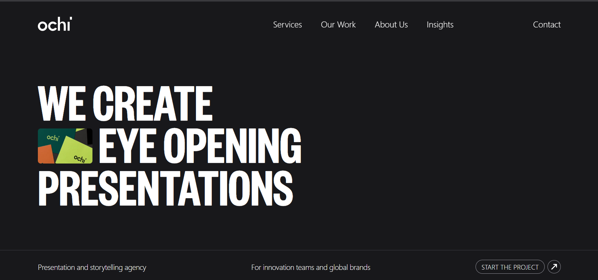
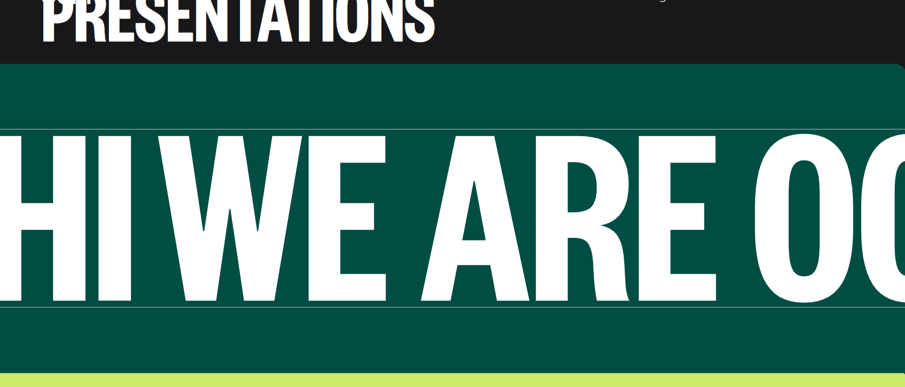
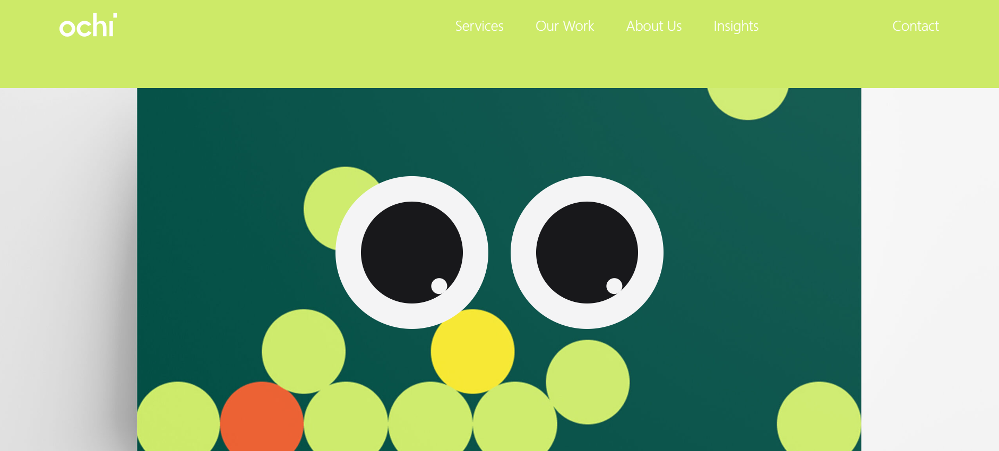
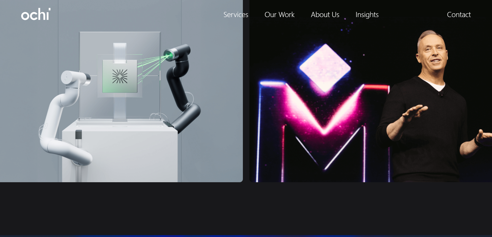

🎬 Ochi Clone

A fully responsive Ochi clone website built using modern web technologies. This project replicates the design and functionality of the Ochi website, with smooth animations, transitions, and a clean UI.

🚀 Features

⚡ Responsive design for all devices

🎨 Pixel-perfect UI clone

🌀 Smooth animations & transitions

🔥 Built with React + TailwindCSS

📱 Mobile-first approach

🛠️ Tech Stack

React.js – Frontend framework

TailwindCSS – Styling & responsiveness

Framer Motion – Animations

Vite / Create React App / Next.js (whichever you used – replace here)

📸 Screenshots

